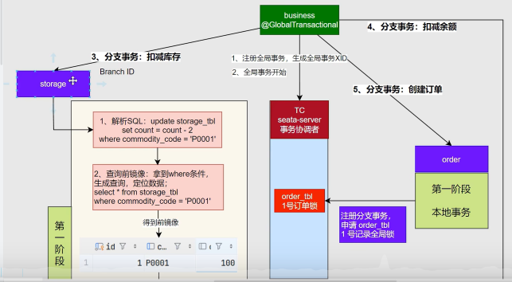

# 微服务SpringCloud

数据来源：b站，尚硅谷SpringCloud教程https://www\.bilibili\.com/video/BV1UJc2ezEFU?spm\_id\_from=333\.788\.videopod\.sections\&vd\_source=2ccfafe0b74b73971da28e0853701ecc\&p=70


## 一、分布式基础

单体架构：所有模块都在一个项目，部署简单，但是不能应对高并发

集群架构：多个服务器在一个项目，解决大并发问题，但是不能解决多语言开发和模块化升级

分布式架构：大型项目多个模块部署在多个服务器中


版本管理：


```XML
<properties>
    <maven.compiler.source>17</maven.compiler.source>
    <maven.compiler.target>17</maven.compiler.target>
    <project.build.sourceEncoding>UTF-8</project.build.sourceEncoding>
    <spring-cloud.version>2023.0.3</spring-cloud.version>
    <spring-cloud-alibaba.version>2023.0.3.2</spring-cloud-alibaba.version>
</properties>
<dependencyManagement>
    <dependencies>
        <dependency>
            <groupId>org.springframework.cloud</groupId>
            <artifactId>spring-cloud-dependencies</artifactId>
            <version>${spring-cloud.version}</version>
            <type>pom</type>
            <scope>import</scope>
        </dependency>
        <dependency>
            <groupId>com.alibaba.cloud</groupId>
            <artifactId>spring-cloud-alibaba-dependencies</artifactId>
            <version>${spring-cloud-alibaba.version}</version>
            <type>pom</type>
            <scope>import</scope>
        </dependency>
    </dependencies>
</dependencyManagement>
```

## 二、Nacos注册中心

服务注册和服务发现

### 2\.1 服务注册

1. 启动微服务

2. 引入服务发现依赖

3. 配置nacos地址

4. 查看注册中心效果

5. 集群模式启动测试

```Dockerfile
spring.application.name=service-order
server.port=8000

spring.cloud.nacos.server-addr=127.0.0.1:8848
```

### 2\.2 服务发现

1. 开启服务发现功能@EnableDiscoveryClient

2. 测试服务发现API DiscoveryClient

3. 测试服务发现API NacosServiceDiscovery

```TypeScript
@SpringBootTest
public class DiscoveryTest {
    @Autowired
    DiscoveryClient discoveryClient;
    @Autowired
    NacosDiscoveryClient nacosDiscoveryClient;
    @Test
    void discoveryClientTest(){
        for(String service: discoveryClient.getServices()){
            System.*out*.println(service);
            List<ServiceInstance> serviceInstances = discoveryClient.getInstances(service);
            for(ServiceInstance serviceInstance: serviceInstances){
                System.*out*.println(serviceInstance.getHost() + ":" + serviceInstance.getPort());
            }
        }
    }
}
```

@Autowired
    DiscoveryClient discoveryClient;
    @Autowired
    NacosDiscoveryClient nacosDiscoveryClient;

一个是SpringCloud自己的，都可以用，一个是Nacos专用的

### 2\.3 服务请求

```Java
private Product getProductFromRemote(Long productId) {
        *//第一版 discoveryClient*
*//        List<ServiceInstance> instances = discoveryClient.getInstances("service-product");*
*//        String url =instance.getUri()+"/product/"+productId;*

*        //第二版 负载均衡*
*//        ServiceInstance instance = loadBalancerClient.choose("service-product");*
*//        String url =instance.getUri()+"/product/"+productId;*

*        //第三版 注解*
*        *String url = "http://service-product/product/"+productId;
        *log*.info("远程请求路径url:{}",url);
        Product product = restTemplate.getForObject(url, Product.class);
        return product;
    }
```

注：注解（在restTemplate上注解@LoadBalanced）

## 三、Nacos配置中心

不停机配置

### 3\.1 静态刷新

启动Nacos \-\> 引入依赖 \-\> application\.properties配置 \-\> 创建data\-id\(数据集）

```Dockerfile
spring.config.import=nacos:service-order.properties# data-id就是:后面的内容
# 一旦引入了项目配置中心，但是配置文件没有，就会报错
spring.cloud.nacos.config.import-check.enabled=false
```

```TypeScript
@RefreshScope//自动刷新
@RestController
public class OrderController {
    @Autowired
    OrderService orderService;

    @Value("${order.timeout}")
    String orderTimeout;
    @Value("${order.auto-confirm}")
    String orderAutoConfirm;
```

### 3\.2 动态刷新

```TypeScript
@Component
@Data
@ConfigurationProperties(prefix = "order")*//可以实现自动刷新*
public class OrderProperties {
    String timeout;
    String autoConfirm;
}
```

### 3\.3 监听配置变化

```TypeScript
@SpringBootApplication
public class OrderMainApplication {
    public static void main(String[] args) {
        SpringApplication.*run*(OrderMainApplication.class, args);
    }

    *//1. 项目启动就监听配置文件变化*
*    //2. 发生变化后拿到变化值*
*    //3. 发送邮件*

*    *@Bean*//方法上的组件会自动从容器中拿*
*    *ApplicationRunner applicationRunner(NacosConfigManager nacosConfigManager){*//一次性任务，项目只要启动起来就会执行这个任务*
*        *return new ApplicationRunner() {
            @Override
            public void run(ApplicationArguments args) throws Exception {
                ConfigService configService = nacosConfigManager.getConfigService();
                configService.addListener("service-order.properties", "DEFAULT_GROUP", new Listener(){
                    @Override
                    public void receiveConfigInfo(String configInfo) {
                        System.*out*.println("配置文件变化了："+configInfo);
                        System.*out*.println("发送邮件");
                    }
                    @Override
                    public Executor getExecutor() {
                        return Executors.*newFixedThreadPool*(4);
                    }
                });
                System.*out*.println("========");
            }
        };
    }
}
```

### 3\.4 数据隔离

假如项目有多套环境（dev,test,prod），每个微服务同一种配置，在每套环境的值不一样，项目可以通过切换环境加载本环境的配置

**难点：**区分多套环境、多种微服务、多种配置、按需加载配置

**解决：**

- 命名空间区分多套环境

- Group区分多种微服务

- 数据集区分多种配置

```YAML
server:
  port: 8080

spring:
  profiles:
    active:
      on-profile:test
  application:
    name: service-order
  cloud:
    nacos:
      server-addr: 127.0.0.1:8848
      config:
        namespace: ${spring.profiles.active:public}
        import-check:
          enabled: false *# 必须写，因为上面的是默认配置，默认没有配置*
---
spring:
  config:
    import:
      - nacos:common.properties?group=order
      - nacos:database.properties?group=order
    activate:
      on-prodile:test
---
spring:
  config:
    import:
      - nacos:common.properties?group=order
      - nacos:database.properties?group=order
    activate:
      on-prodile:prod
---
spring:
  config:
    import:
      - nacos:common.properties?group=order
      - nacos:database.properties?group=order
    activate:
      on-prodile:dev
```

## 四、openFeign远程调用

### 4\.1 流程

声明式REST客户端 vs 编程式REST客户端（RestTemplate）

注解驱动：

1. 远程地址：@FeignClient

2. 指定请求方式：复用SpringMVC

3. 指定携带数据:复用SpringMVC

4. 指定结果返回：响应模型

```Dockerfile
<dependency>
    <groupId>org.springframework.cloud</groupId>
    <artifactId>spring-cloud-starter-openfeign</artifactId>
</dependency>
```

```Java
@FeignClient(value="service-product")
public interface ProductFeignClient {
    @GetMapping("/product/{id}")*//在springMVC上是接收这样的请求，在openFeign上是发送这样的请求*
*    *Product getProductById(@PathVariable("id")Long id, @RequestHeader("token")String token);*//id在springMVC上是接收的参数，在openFeign上是发送的参数*
}
```

### 4\.2 日志

1. 配置文件

```Dockerfile
logging:
    level:
        com.cyy.order.feign: debug
```

2. 组件【官方说明了会去容器中找】

```Dockerfile
@Bean
Logger.Level feignLoggerLevel(){
    return Logger.Level.FULL;
}
```

### 4\.3 超时控制

返回错误信息or兜底数据

1. connectTimeout:建立连接 默认十秒

2. readTimeout：处理数据 默认六十秒

```Dockerfile
spring:
  profiles:
    active: dev
    include: feign *#会激活application-feign.yml（Feign 特定配置）*
```

```YAML
spring:
  cloud:
    openfeign:
      client:
        config:
          default:
            logger-level: *full*
*            *connect-timeout: 3000
            read-timeout: 5000
          service-product:
            logger-level: *full*
*            *connect-timeout: 3000 #毫秒
            read-timeout: 5000
```

### 4\.4 重试机制

默认不重试

1. 配置文件

2. ioc【官方写明会去容器中找】

```Dockerfile
@Bean
Retryer retry(){
    return new Retryer.Default();//默认是this(100L, TimeUnit.*SECONDS*.toMillis(1L), 5);
    //间隔100毫秒，最大为1秒，最大间隔5次。因为每次请求失败后间隔上次时长*1.5
}
```

注：是在请求失败后继续，最终界面是到重试后还不行才结束

### 4\.5 拦截器

分为请求拦截器和响应拦截器（用的不多）

配置文件 or 容器

```YAML
service-product:
            logger-level: *full*
*            *connect-timeout: 3000
            read-timeout: 5000
*#            request-interceptors:*
*#              - com.example.feign.interceptor.FeignRequestInterceptor*
```

```TypeScript
@Component
public class XTokenRequestInterceptor implements RequestInterceptor {
    @Override
    public void apply(RequestTemplate requestTemplate) {
        System.*out*.println("拦截器启动");
        requestTemplate.header("X-Token", UUID.*randomUUID*().toString());
    }
}
```

### 4\.6 Fallback兜底返回

注：此功能需要整合Sentinel才能实现

```Java
@Component//放到组件里
public class ProductFeignClientFallback implements com.cyy.order.feign.ProductFeignClient {
    @Override
    public Product getProductById(Long id) {
        System.*out*.println("fallback");
        Product product = new Product();
        product.setId(0L);
        product.setName("未知商品");
        product.setPrice(new BigDecimal("0.00"));
        product.setNum(0);
        return product;
    }
}
```

```Java
@FeignClient(value="service-product",fallback = ProductFeignClientFallback.class)//添加
public interface ProductFeignClient {
    @GetMapping("/product/{id}")*//在springMVC上是接收这样的请求，在openFeign上是发送这样的请求*
*    *Product getProductById(@PathVariable("id")Long id);*//id在springMVC上是接收的参数，在openFeign上是发送的参数*
}
```

Sentinel

```Dockerfile
<dependency>
    <groupId>com.alibaba.cloud</groupId>
    <artifactId>spring-cloud-starter-alibaba-sentinel</artifactId>
</dependency>
```

```Dockerfile
feign:
  sentinel:
    enabled: true
```

## 五、Sentinel

服务保护（限流、熔断降级）。以流量为切入点，从流量控制、流量路由、熔断降级、系统自适应过载保护、热点流量防护等多个维度保护服务的稳定性

定义资源和规则：

1. 资源：主流架构自动适配，编程式SphU API 或者声明式@SentinelResource

2. 规则：流量控制，熔断降级，系统保护，来源访问控制，热点参数

### 5\.1 下载登录引用

1. 下载

```XML
<dependency>
    <groupId>com.alibaba.csp</groupId>
    <artifactId>sentinel-transport-simple-http</artifactId>
    <version>x.y.z</version>
</dependency>
```

```Dockerfile
-- 控制台启动
java -jar sentinel-dashboard-1.8.10.jar
```

在localhost:8080,默认账号和密码都是sentinel

https://github\.com/alibaba/Sentinel/releases/tag/1\.8\.10

2. 引用

```Dockerfile
sentinel:
  transport:
    dashboard: localhost:8080
  eager: true *#项目一启动自动连上控制台*
```

3. 使用

```Dockerfile
@Override
@SentinelResource(value="createOrder")
public Order createOrder(Long productId, Long user) {
```

QPS每秒通行数量

### 5\.2 异常处理

会抛出BlockException

```Java
@Component
public class MyBlockExceptionHandler implements BlockExceptionHandler {
    private ObjectMapper objectMapper = new ObjectMapper();*//springmvc默认的json转换器*
*    *@Override
    public void handle(HttpServletRequest httpServletRequest, HttpServletResponse httpServletResponse, String s, BlockException e) throws Exception {
        PrintWriter writer = httpServletResponse.getWriter();
        httpServletResponse.setContentType("application/json;charset=utf-8");
        R r = R.*error*(500, s + "被sentinel限制了" + e.getMessage());
        
        String json = objectMapper.writeValueAsString(r);
        
        writer.write(json);
    }
}
```


如图：如果@SentinelResource标注了default、fallback、blockHandler就按照这些方法来兜底处理，没有就按照SpringMVC来处理

```Dockerfile
sphU.entry("资源名")//+处理异常
```

注：最好写fallback异常，因为可以处理1/0等异常

### 5\.3 流控规则

限制请求数量，防止雪崩

**流控配置：**

1. 资源名：自己起、openFeign、类

2. 阈值类型：QPS/并发线程数。前者比较轻量，后者需要统计线程池等，比较慢。

3. 是否集群：单机均摊、总体阈值

**流控模式：**

1. 直接：直接限制资源A，默认

2. 链路：需要填链路，例如控制资源A\-B限流，C\-B不限流

    - 注：需要关闭上下文统一

    ```Dockerfile
    spring.cloud.sentinel.web-context-unify:false
    ```

3. 关联：优先写，限制读（在写请求量较大的情况）。给readDB关联writeDB。

**流控效果：**

1. 快速失败：多个直接拒绝（抛出异常）

2. 预热/冷：从每秒接受3个到5个到最高的，Qps=3，period=3，到达峰值3需要经过3秒，之后稳定处理10个请求

3. 匀速排队：QPS=2，每500ms一个，不支持QPS\>1000。多余的在后面的时间排队，大于timeout就丢弃。

    - 漏桶算法

注意：只有快速失败才支持流控模式的其它选择，其它的只支持直接流控模式

### 5\.4 熔断规则

切断不稳定的调用，快速返回不积压，避免雪崩效应。通常在客户端进行配置。熔断降级

断路器：打开、关闭、半开

三种熔断比例：慢调用比例、异常比例、异常数


1. 慢调用比例：慢调用比例为70%，慢调用设置为1s,放行100个请求，慢调用比例到达了70%就开启打开状态

2. 异常比例：放行的100个请求，给我返回错误的比例

3. 异常数：返回的错误数量

### 5\.5 热点规则

更细节的流控规则，利用热点数据

## 六、网关

前端把请求给网关，网关去注册中心找。还可以执行负载均衡。身份认证。

1. Reactive Server:基于响应式的，较为轻量（推荐）

2. ServerMVC:传统的

### 6\.1 基本流程

```XML
<dependencies>
    <dependency>
        <groupId>com.alibaba.cloud</groupId>
        <artifactId>spring-cloud-starter-alibaba-nacos-discovery</artifactId>
    </dependency>
    <dependency>
        <groupId>org.springframework.cloud</groupId>
        <artifactId>spring-cloud-starter-gateway</artifactId>
    </dependency>
    <dependency>
        <groupId>org.springframework.cloud</groupId>
        <artifactId>spring-cloud-starter-loadbalancer</artifactId>
    </dependency>
</dependencies>
```

```YAML
spring:
  cloud:
    gateway:
      routes: *# 有序的，前面有就不会匹配后面的*
*        *- id: order-route *#全局唯一*
*          *uri: lb://service-order *# lb是loadbalance的简写*
*          *predicates:
            - Path=/api/order/**
        *#          filters:*
*        #          order*
*        *- id: product-route
          uri: lb://service-product
          predicates:
            - Path=/api/product/**
            
        - id: test
          uri: https://cn.bing.com/
          predicates:
            - Path=/search
            - name: Query *#一定要都满足*
*              *args:
                param: q
                regexp: haha
```


### 6\.2 自定义断言工厂

```TypeScript
@Component
public class VipRoutePredicateFactory extends AbstractRoutePredicateFactory<VipRoutePredicateFactory.Config> {
//名称前缀需要和断言名字一样Vip
    public VipRoutePredicateFactory() {
        super(Config.class);
    }

    @Override
    public List<String> shortcutFieldOrder(){
        return Arrays.*asList*("param","value");
    }

    @Override
    public Predicate<ServerWebExchange> apply(Config config) {
        return new GatewayPredicate() {
            @Override
            public boolean test(ServerWebExchange serverWebExchange) {
                ServerHttpRequest request = serverWebExchange.getRequest();
                String first = request.getQueryParams().getFirst(config.param);
                return StringUtils.*hasText*(first)&& first.equals("cyy");
            }
        };
    }


    */**
*    可以配置的参数*
*     */*
*    *@Validated
    public static class Config {
        private @NotEmpty String param;
        private @NotEmpty String value;

        public String getParam() {
            return this.param;
        }

        public VipRoutePredicateFactory.Config setParam(String param) {
            this.param = param;
            return this;
        }

        public String getValue() {
            return this.value;
        }

        public VipRoutePredicateFactory.Config setValue(String value) {
            this.value = value;
            return this;
        }
    }
}
```

### 6\.3 过滤器\&路径重写\&默认filter\&Globalfilter

```Dockerfile
filters:
  - RewritePath=/api/order/(?<segment>.*), /${segment}  *#(?<segment>.*)封装在segment中*
```

```YAML
spring:
  cloud:
    gateway:
      default-filters: 
        - AddResponseHeader=X-Response-Default-Foo, Default-Bar
```

globalfilter对全局有效

```Java
@Slf4j
@Component
public class RtGlobalFilter implements GlobalFilter, Ordered {*//全异步方法*
*    *@Override
    public Mono<Void> filter(ServerWebExchange exchange, GatewayFilterChain chain) {
        ServerHttpRequest request = exchange.getRequest();
        ServerHttpResponse response = exchange.getResponse();
        String uri = request.getURI().toString();
        long start=System.*currentTimeMillis*();
        *log*.info("请求{}开始,时间：{}",uri, start);

        Mono<Void> filter = chain.filter(exchange)
                .doFinally((result)-> {
                            long end = System.*currentTimeMillis*();
                            *log*.info("请求{}结束{},耗时{}毫秒",uri, end,end-start);
                        }
                );

        return filter;
    }

    @Override
    public int getOrder() {
        return 0;
    }
}
```

### 6\.4 自定义网关过滤器工厂

```TypeScript


@Component
public class OnceTokenGatewayFilterFactory extends AbstractNameValueGatewayFilterFactory {
    @Override
    public GatewayFilter apply(NameValueConfig config) {
        return new GatewayFilter() {
            @Override
            public Mono<Void> filter(ServerWebExchange exchange, GatewayFilterChain chain) {
                *//每次请求前添加一个一次性令牌 uuid*

*                *return chain.filter(exchange).then(Mono.*fromRunnable*(()->{
                    String value = config.getValue();
                    if("uuid".equals(value)){
                        value = UUID.*randomUUID*().toString();
                    }
                    else if("jwt".equals( value)){
                        value = "这是一个jwt...";
                    }
                    exchange.getResponse().getHeaders().add(config.getName(),value);
                }));
            }
        };
    }
}
```

```Dockerfile
- OnceToken=token,jwt
```

### 6\.5 全局跨域

1. 单体情况下可以在Controller上标注@CrossOrigin,这样这个Controller中都可以允许前端跨域访问

2. 微服务下可以使用CorsFilter,但是单位是单个微服务

3. 所以给网关设置就好了

```YAML
spring:
    cloud:
        gateway:
            globalcors:
              cors-configurations:
                '[/**]': *# 匹配所有路径*
            *      *allowedOrigins: "*" *#允许所有的跨域*
            *      *allowedMethods: "*" *#允许所有的方法*
            *      *allowed-headers: "*" *#允许所有的请求头*
```

## 七、Seata

分布式事务：多个数据库一起提交/回滚的一站式解决方案，因为@Transaction只负责自己的数据库回滚

1. TC：维护全局和分支事务的状态，驱动全局事务提交或回滚

2. TM：事务管理器：定义全局事务范围，开启全局事务的提交或者回滚

3. RM：资源管理器，管理分支事务处理的资源，与TC交谈以注册分支事务和报告分支事务的状态，并驱动分支事务提交或回滚


file\.conf

```Bash
service {
  *#transaction service group mapping*
*  *vgroupMapping.default_tx_group = "default"
  *#only support when registry.type=file, please don't set multiple addresses*
*  *default.grouplist = "127.0.0.1:8091"
  *#degrade, current not support*
*  *enableDegrade = false
  *#disable seata*
*  *disableGlobalTransaction = false
}
```

```Dockerfile
<dependency>
    <groupId>com.alibaba.cloud</groupId>
    <artifactId>spring-cloud-starter-alibaba-seata</artifactId>
</dependency>
```

```Dockerfile
@GlobalTransaction//在全局事务标注即可
```

### 7\.1 二阶提交协议流程




### 7\.2 Seata的四种事务模式

配置seata\.data\-source\-proxy\-mode

1. AT 模式（默认）（推荐）

2. XA 模式，遵循数据库的模式，第一阶段不会真正提交（性能低下）

3. TCC模式，全手动模式的二阶提交协议

4. Saga模式，长事务，适用业务流程长

